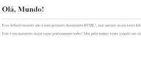
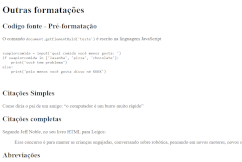
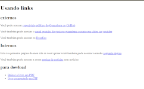
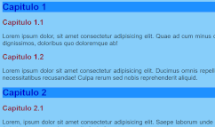
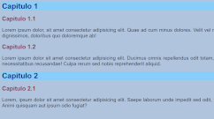
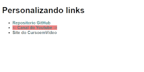
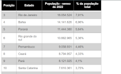
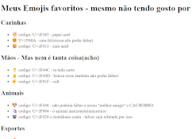
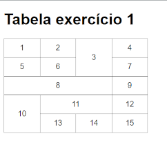

# HTML5 e CSS3 - Curso em vídeo
 Curso de HTML5 e CSS3 do curso em vídeo. Estou aprendendo à criar sites no curso em vídeo, com o professor Gustavo Guanabara. Espero que aprenda bastante. 

Veja os exercícios e os desafios:

## Exercícios

| Imagem | Nome | Descrição | Acesso |
| --------- |----|-------| -------- |
|  | Ex001 | Projeto inícial Com o famoso olá mundo, usando tags como h1, p, e hr.| [aqui](https://pedro-makoski.github.io/html-css-cursoemvideo/exercicios/ex001) |
|  | Ex002 | Aprendendo HTML entities e quebra de linha com br. | [aqui](https://pedro-makoski.github.io/html-css-cursoemvideo/exercicios/ex002) |
|  | Ex003 | Aprendendo a colocar imagens em HTML com img. | [aqui](https://pedro-makoski.github.io/html-css-cursoemvideo/exercicios/ex003) |
|  | Ex004 | Colocando favicons em HTML. | [aqui](https://pedro-makoski.github.io/html-css-cursoemvideo/exercicios/ex004) |
|  | Ex006 | Aprendendo hierarquia de títulos h1 até h6. | [aqui](https://pedro-makoski.github.io/html-css-cursoemvideo/exercicios/ex006) |
|  | Ex007 | aprendendo a diferença do HTML4 e HTML5, com a semântica. | [html4](https://pedro-makoski.github.io/html-css-cursoemvideo/exercicios/ex007/html4.html), [html5](https://pedro-makoski.github.io/html-css-cursoemvideo/exercicios/ex007/html5.html) |
|  | Ex008 | fazendo formatações de textos de forma semântica e não semântica | [aqui](https://pedro-makoski.github.io/html-css-cursoemvideo/exercicios/ex008) |
|  | Ex008b | Outras formatações de texto. | [aqui](https://pedro-makoski.github.io/html-css-cursoemvideo/exercicios/ex008b) |
|  | Ex009 | aprendendo listas html: ol, ul, dl. | [aqui](https://pedro-makoski.github.io/html-css-cursoemvideo/exercicios/ex009) |
|  | Ex010 | Aprendendo à usar links em HTML: a. | [index](https://pedro-makoski.github.io/html-css-cursoemvideo/exercicios/ex010), [pag002](https://pedro-makoski.github.io/html-css-cursoemvideo/exercicios/ex010/pag002.html), [pag003](https://pedro-makoski.github.io/html-css-cursoemvideo/exercicios/ex010/noticias/pag003.html) |
|  | Ex011 | Aprendendo à fazer imagens responsivas e colocar áudio no HTML. | [ex011](https://pedro-makoski.github.io/html-css-cursoemvideo/exercicios/ex011) |
|  | Ex011b | Aprendendo à colocar vídeo em HTML, a partir de um arquivo interno, do Youtube ou Vimeo | [aqui](https://pedro-makoski.github.io/html-css-cursoemvideo/exercicios/ex011b) |
|  | Ex012 | Estilos in-line CSS. | [aqui](https://pedro-makoski.github.io/html-css-cursoemvideo/exercicios/ex012) | 
|  | Ex012b | Estilos internos CSS. | [aqui](https://pedro-makoski.github.io/html-css-cursoemvideo/exercicios/ex012b) |
|  | Ex012c | Estilos externos CSS. | [aqui](https://pedro-makoski.github.io/html-css-cursoemvideo/exercicios/ex012c), [pagina2](https://pedro-makoski.github.io/html-css-cursoemvideo/exercicios/ex012c/pagina02.html) |
|  | Ex013 | Aprendendo cores, harmonia, formas de representa-la, gradiente com css e criamos um pequeno projeto, com tudo isso. | [cor01](https://pedro-makoski.github.io/html-css-cursoemvideo/exercicios/ex013/cor01.html), [cor02](https://pedro-makoski.github.io/html-css-cursoemvideo/exercicios/ex013/cor02.html), [cor03](https://pedro-makoski.github.io/html-css-cursoemvideo/exercicios/ex013/cor03.html) |
|  | Ex014 | Aprendendo à formatar fontes | [fonte01](https://pedro-makoski.github.io/html-css-cursoemvideo/exercicios/ex014/fonte01.html), [fonte02](https://pedro-makoski.github.io/html-css-cursoemvideo/exercicios/ex014/fonte02.html) |
|  | Ex014b | Aprendendo à usar fontes externas tanto pelo Google Fonts, ou baixada: ttf(truetype), otf(opentype) | [fonte01](https://pedro-makoski.github.io/html-css-cursoemvideo/exercicios/ex014b/fonte01.html), [fonte02](https://pedro-makoski.github.io/html-css-cursoemvideo/exercicios/ex014b/fonte02.html) |
|  | Ex015 | Aprendendo a diferença de class e id. E como seleciona-los no CSS. | [aqui](https://pedro-makoski.github.io/html-css-cursoemvideo/exercicios/ex015/seletor01.html) |
|  | Ex015b | Aprendendo pseudo-elementos e pseudo-classes. | [hover](https://pedro-makoski.github.io/html-css-cursoemvideo/exercicios/ex015b/hover.html), [links](https://pedro-makoski.github.io/html-css-cursoemvideo/exercicios/ex015b/links.html), [pseudo-classe](https://pedro-makoski.github.io/html-css-cursoemvideo/exercicios/ex015b/pseudoclasse.html) |
|  | Ex016 | Aprendendo Box-model: box-shadow, padding, margin, border, outline, content, width, height, div, outras divs só que semântica, article, section, footer, main, header e etc. | [caixa01](https://pedro-makoski.github.io/html-css-cursoemvideo/exercicios/ex016/caixa01.html), [caixa02](https://pedro-makoski.github.io/html-css-cursoemvideo/exercicios/ex016/caixa02.html), [caixa03](https://pedro-makoski.github.io/html-css-cursoemvideo/exercicios/ex016/caixa03.html) |
|  | Ex017 | Aprendendo as propriedades do background-image, e como alinhar uma caixa verticalmente, com position relative e absolute. | [fundo001](https://pedro-makoski.github.io/html-css-cursoemvideo/exercicios/ex017/fundo001.html), [fundo002](https://pedro-makoski.github.io/html-css-cursoemvideo/exercicios/ex017/fundo002.html), [fundo003](https://pedro-makoski.github.io/html-css-cursoemvideo/exercicios/ex017/fundo003.html), [fundo004](https://pedro-makoski.github.io/html-css-cursoemvideo/exercicios/ex017/fundo004.html), [fundo005](https://pedro-makoski.github.io/html-css-cursoemvideo/exercicios/ex017/fundo005.html), [fundo005b](https://pedro-makoski.github.io/html-css-cursoemvideo/exercicios/ex017/fundo005b.html), [fundo006](https://pedro-makoski.github.io/html-css-cursoemvideo/exercicios/ex017/fundo006.html), [fundo007](https://pedro-makoski.github.io/html-css-cursoemvideo/exercicios/ex017/fundo007.html). | 
|  | Tabelas | Aprendendo várias propriedades de tabelas. De forma Semântica. | [Tabela001](https://pedro-makoski.github.io/html-css-cursoemvideo/exercicios/ex018/tabela001.html), [Tabela002](https://pedro-makoski.github.io/html-css-cursoemvideo/exercicios/ex018/tabela002.html), [Tabela003](https://pedro-makoski.github.io/html-css-cursoemvideo/exercicios/ex018/tabela003.html), [Tabela004](https://pedro-makoski.github.io/html-css-cursoemvideo/exercicios/ex018/tabela004.html), [Tabela005](https://pedro-makoski.github.io/html-css-cursoemvideo/exercicios/ex018/tabela005.html), [Tabela006](https://pedro-makoski.github.io/html-css-cursoemvideo/exercicios/ex018/tabela006.html). |
|  | Iframes | Aprendendo a usar iframes. | [iframe001](https://pedro-makoski.github.io/html-css-cursoemvideo/exercicios/ex019/iframe001.html), [iframe002](https://pedro-makoski.github.io/html-css-cursoemvideo/exercicios/ex019/iframe002.html), [iframe003](https://pedro-makoski.github.io/html-css-cursoemvideo/exercicios/ex019/iframe003.html), [iframe004](https://pedro-makoski.github.io/html-css-cursoemvideo/exercicios/ex019/iframe004.html), [iframe005](https://pedro-makoski.github.io/html-css-cursoemvideo/exercicios/ex019/iframe005.html), [iframe006](https://pedro-makoski.github.io/html-css-cursoemvideo/exercicios/ex019/iframe006.html). | 
|  | Formulários. | Aprendendo tecnicas de formulário, tipos de input e outros. | [form001](https://pedro-makoski.github.io/html-css-cursoemvideo/exercicios/ex020/form001.html), [form002](https://pedro-makoski.github.io/html-css-cursoemvideo/exercicios/ex020/form002.html), [form003](https://pedro-makoski.github.io/html-css-cursoemvideo/exercicios/ex020/form003.html), [form004](https://pedro-makoski.github.io/html-css-cursoemvideo/exercicios/ex020/form004.html), [form005](https://pedro-makoski.github.io/html-css-cursoemvideo/exercicios/ex020/form005.html), [form006](https://pedro-makoski.github.io/html-css-cursoemvideo/exercicios/ex020/form006.html), [form007](https://pedro-makoski.github.io/html-css-cursoemvideo/exercicios/ex020/form007.html), [form008](https://pedro-makoski.github.io/html-css-cursoemvideo/exercicios/ex020/form008.html), [form009](https://pedro-makoski.github.io/html-css-cursoemvideo/exercicios/ex020/form009.html), [form010](https://pedro-makoski.github.io/html-css-cursoemvideo/exercicios/ex020/form010.html) |
|  | Media Queries. | Aprendendo à usar media queries com CSS, para fazer adtaptações entre media types e features. | [mq001](https://pedro-makoski.github.io/html-css-cursoemvideo/exercicios/ex020/form009.html), [mq002](https://pedro-makoski.github.io/html-css-cursoemvideo/exercicios/ex021/mq002), [mq003](https://pedro-makoski.github.io/html-css-cursoemvideo/exercicios/ex021/mq003), [mq004](https://pedro-makoski.github.io/html-css-cursoemvideo/exercicios/ex021/mq004), [mq005](https://pedro-makoski.github.io/html-css-cursoemvideo/exercicios/ex021/mq005). |
## Desafios

| Imagem | Nome | Descrição | Acesso |
| ----- | ------ | -------- | ------  |
|  | Desafio 001 | Desafio de quebra de linha e parágrafo. | [aqui](https://pedro-makoski.github.io/html-css-cursoemvideo/desafios/d001/) | 
|  | Desafio 002 | Imagens em HTML. | [aqui](https://pedro-makoski.github.io/html-css-cursoemvideo/desafios/d002/) |
|  | Desafio 003 | Imagens e quebra de linha HTML. | [aqui](https://pedro-makoski.github.io/html-css-cursoemvideo/desafios/d003/) |
|  | Desafio 004 | Emojis e listas HTML. | [aqui](https://pedro-makoski.github.io/html-css-cursoemvideo/desafios/d004/) |
|  | Desafio 005 | Redes sóciais - links e descrição | [aqui](https://pedro-makoski.github.io/html-css-cursoemvideo/desafios/d005/) |
|  alt="Imagem do desafio 006"| Desafio 006 | Abreviações e listas HTML. | [aqui](https://pedro-makoski.github.io/html-css-cursoemvideo/desafios/d006/) |
|  | Desafio 007 | Imagens flexiveis com a tag picture | [aqui](https://pedro-makoski.github.io/html-css-cursoemvideo/desafios/d007/) |
|  | Desafio 008 | Navegação com links e cores. | [aqui](https://pedro-makoski.github.io/html-css-cursoemvideo/desafios/d008/) |
|  | Desafio 009 | Navegação entre alguns vídeos de curso. | [aqui](https://pedro-makoski.github.io/html-css-cursoemvideo/desafios/d009/) |
|  | Desafio 010 feito por mim | Desafio da história do Android, sem a ajuda do curso, no formato de vídeo. | [aqui](https://pedro-makoski.github.io/html-css-cursoemvideo/desafios/d010-feitopormim/) |
|  | Desafio 010 feito em vídeo | Desafio do Android feito junto em curso. | [aqui](https://pedro-makoski.github.io/html-css-cursoemvideo/desafios/d010-feitojuntoemvideo/android.html) |
|  | Desafio 011 | Desafio do astronauta no centro. | [aqui](https://pedro-makoski.github.io/html-css-cursoemvideo/desafios/d011/) |
|  | Desafio 012 feito por mim. | Desafio do projeto do Cordel de **Milton Duarte**. | [aqui](https://pedro-makoski.github.io/html-css-cursoemvideo/desafios/d012-feito-por-mim/) |
|  | Desafio 012 feito junto em vídeo | Projeto Cordel Moderno, com poema criado por **Milton Duarte**. | [aqui](https://pedro-makoski.github.io/html-css-cursoemvideo/desafios/d012-feito-junto-em-video) |
|  | Desafio de tabelas mescladas. | Desafios de tabelas. | [Tabela 1](https://pedro-makoski.github.io/html-css-cursoemvideo/desafios/d013/tabela001.html), [tabela 2](https://pedro-makoski.github.io/html-css-cursoemvideo/desafios/d013/tabela002.html), [tabela 3](https://pedro-makoski.github.io/html-css-cursoemvideo/desafios/d013/tabela003.html) |
|  | Desafio das redes sóciais. | Desafio feito no curso, usando a tecnológia de iframes, mostrando as redes sóciais. |  [aqui](https://pedro-makoski.github.io/html-css-cursoemvideo/desafios/d014)  | 
|  | Desafio de login. | Desafio feito sozinho. | [aqui](https://pedro-makoski.github.io/html-css-cursoemvideo/desafios/d015-feito-por-mim) |
|  | Desafio de Login. | Desafio de Login feito junto em vídeo. | [aqui](https://pedro-makoski.github.io/html-css-cursoemvideo/desafios/d015-feito-junto-em-video) |